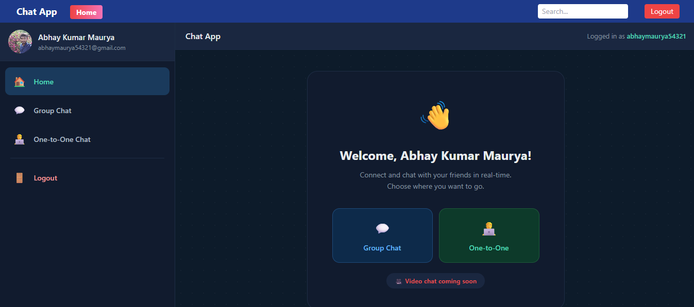
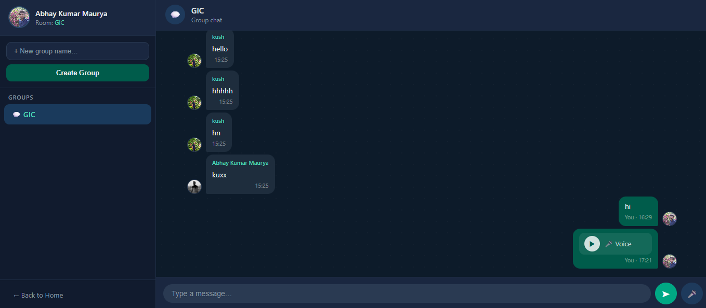
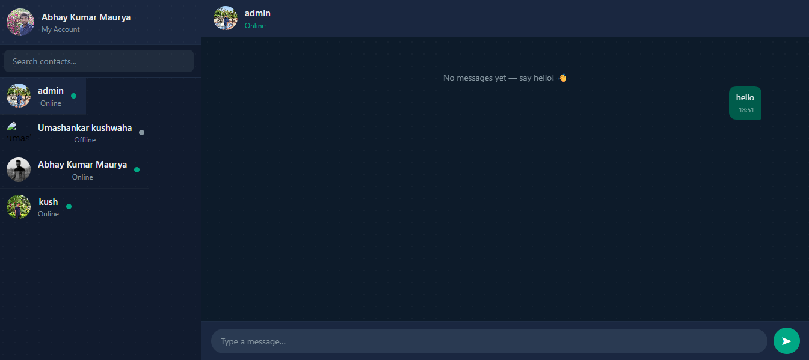

# Django Chat & Voice App 🗨️🎤

A real-time chat and voice messaging application using Django Channels, JWT authentication, Google login, MySQL, Tailwind CSS, and WebSockets.

---

## 📂 Project Structure

```
channel_layers_project/
├── manage.py
├── django_chat_voice/          # Project Core
│   ├── asgi.py
│   ├── settings.py
│   ├── urls.py
│   └── wsgi.py
└── channel_layers_app/         # Main App
    ├── consumers.py
    ├── models.py
    ├── routing.py
    ├── serializers.py
    ├── signals.py
    ├── templates/
    │   ├── base.html
    │   ├── index.html
    │   ├── group_chat.html
    │   ├── one_to_one.html
    │   ├── login.html
    │   ├── register.html
    │   └── token_landing.html
    ├── urls.py
    └── views.py
```

---

## ⚙️ Step 1: Install Django

Install Django using pip in a virtual environment and start a new project.

```bash
pip install django
django-admin startproject channel_layers_project
```

---

## ⚙️ Step 2: Create Chat App

Create an app named **`channel_layers_app`**. This app manages chat, group, and one-to-one messaging.

```bash
python manage.py startapp channel_layers_app
```

---

## 🎨 Step 3: Setup Tailwind CSS

Install and configure Tailwind for styling templates. Run Tailwind watcher for live CSS updates.

Install here → [Django Tailwind Docs](https://django-tailwind.readthedocs.io/en/latest/installation.html)

```python
INSTALLED_APPS = [
    'tailwind',
    'theme',
]

INTERNAL_IPS = [
    "127.0.0.1",
]

TAILWIND_APP_NAME = 'theme'

MIDDLEWARE = [
    'social_django.middleware.SocialAuthExceptionMiddleware',
]

LOGIN_URL = '/base/'
LOGOUT_REDIRECT_URL = '/login/'
```

---

## 🔑 Step 4: Google Console Keys

- Create a Google Cloud Console project.
- Enable OAuth2 and generate **Client ID** and **Secret Key**.

```python
SOCIAL_AUTH_GOOGLE_OAUTH2_KEY = "xxxxxxxxxx.apps.googleusercontent.com"
SOCIAL_AUTH_GOOGLE_OAUTH2_SECRET = ""
```

---

## 🔐 Step 5: Google Login (Social Authentication)

Configure Django Social Auth with Google OAuth2. Setup login, redirect, and logout URLs.

```python
LOGIN_URL = '/base/'
LOGOUT_REDIRECT_URL = '/login/'

SOCIAL_AUTH_GOOGLE_OAUTH2_SCOPE = ['email', 'profile']
SOCIAL_AUTH_LOGIN_REDIRECT_URL = '/get-jwt-token-after-google-login/'
SOCIAL_AUTH_URL_NAMESPACE = "social"
```

---

## 🛠️ Step 6: Install Django REST Framework

Install **DRF** for building API endpoints (login, registration, chat, audio).

Install here → [Django REST Framework Docs](https://www.django-rest-framework.org/)

```python
INSTALLED_APPS = [
    'rest_framework',
]
```

---

## 🔑 Step 7: JWT Authentication

Setup **JWT** authentication with DRF SimpleJWT. Tokens are issued after login or Google login.

```python
REST_FRAMEWORK = {
    'DEFAULT_AUTHENTICATION_CLASSES': (
        'rest_framework_simplejwt.authentication.JWTAuthentication',
    )
}

SIMPLE_JWT = {
    "ACCESS_TOKEN_LIFETIME": timedelta(minutes=5),
    "REFRESH_TOKEN_LIFETIME": timedelta(days=7),
    "ROTATE_REFRESH_TOKENS": True,
    "BLACKLIST_AFTER_ROTATION": False,
    "UPDATE_LAST_LOGIN": True,
}
```

---

## 🗄️ Step 8: MySQL Database Connection

Connect Django to a MySQL database and add credentials in settings.

```python
DATABASES = {
    'default': {
        'ENGINE': 'django.db.backends.mysql',
        'NAME': 'your_db_name',
        'USER': 'root',
        'PASSWORD': 'your_password',
        'HOST': 'localhost',
        'PORT': '3306',
    }
}
```

---

## 🔄 Step 9: Google Login → JWT Flow

1. User logs in via Google.
2. Backend issues a JWT token.
3. Token is sent to frontend for secure requests.

---

## 🎨 Step 10: Tailwind Development

Run Tailwind CLI/watch mode for styling updates.

```bash
python manage.py tailwind start
```

---

## 🚀 Step 11: Cache Server (Redis)

Install and start Redis. Redis handles WebSocket connections for Django Channels.

Install here → [Redis Docs](https://redis.io/)

```python
CHANNEL_LAYERS = {
    "default": {
        "BACKEND": "channels_redis.core.RedisChannelLayer",
        "CONFIG": {
            "hosts": [("127.0.0.1", 6379)],
        },
    },
}
```

```bash
redis-server
```

---

## 🖥️ Step 12: Run Django Server

```bash
python manage.py runserver
```

---

## 📝 Step 13: First URL → Register Page

- First page shown: **Register form**.
- Registration API saves the user in the database.

**Gmail SMTP Setup:**

```python
EMAIL_BACKEND = 'django.core.mail.backends.smtp.EmailBackend'
EMAIL_HOST = 'smtp.gmail.com'
EMAIL_PORT = 587
EMAIL_USE_TLS = True
EMAIL_HOST_USER = 'your@gmail.com'
EMAIL_HOST_PASSWORD = 'your-app-password'
DEFAULT_FROM_EMAIL = EMAIL_HOST_USER
```

---

## 🔑 Step 14: Login & JWT Tokens

- Login issues a JWT token stored on the frontend.
- On login/logout, a Gmail notification is sent via Django signals.

---

## 🏠 Step 15: Base Template (Index)

After login, users are redirected to the **index page** showing:

- Groups
- One-to-one chats
- Online users

---

## 📦 Step 16: Models Overview

| Model | Fields |
|---|---|
| `Group` | name |
| `ChatMessage` | user, group, message, timestamp, audio |
| `OneToOneMessage` | sender, receiver, message, time |
| `UserProfile` | user, online/offline status, profile info |

---

## 🗂️ Step 17: Index Page Rendering

- Index shows all groups & one-to-one chats.
- If no group exists → create a new one.

---

## 💬 Step 18: Group Chat Workflow

- Group chat via URL: `/index/<group_name>/`
- WebSocket connection: `/ws/ac/<group_name>/`

---

## 🗄️ Step 19: Chat Storage

- All chat messages are stored in the database.
- Previous messages are displayed when joining a group.

---

## 🎤 Step 20: Audio Recording & Upload

- User records audio in the browser.
- Audio is sent to API → saved in DB.
- WebSocket shares the audio link with the group.

---

## 💌 Step 21: One-to-One Messaging

- Users can select a contact for private chat.
- Real-time messages if online, stored if offline.

---

## 👤 Step 22: Online/Offline Tracking

- Django signals + WebSocket consumers track user status.
- Online/offline status is displayed on profiles.

---

## 🖼️ Step 23: Profile & Messaging

- Each user has a profile (avatar, status).
- Messages are handled differently depending on whether the recipient is online or offline.

---

## ✅ Final Workflow

1. User registers or logs in (JWT / Google OAuth2).
2. JWT token issued → stored on frontend.
3. Redirect to index page.
4. User can:
   - Join / create group chat
   - Send text or audio messages
   - Start a private one-to-one chat
   - View online users
5. All messages stored in the database.
6. Real-time updates via WebSockets.
7. Audio saved in media storage and shared via chat link.

---

## ☁️ Deployment on Render

This project is deployed on [Render](https://render.com). Follow the steps below to deploy it yourself.

---

### Step 1: Install Production Dependencies

```bash
pip install gunicorn dj-database-url whitenoise python-decouple
pip freeze > requirements.txt
```

---

### Step 2: Update settings.py for Production

```python
import os
import dj_database_url
from decouple import config

SECRET_KEY = config('SECRET_KEY')
DEBUG = config('DEBUG', default=False, cast=bool)
ALLOWED_HOSTS = config('ALLOWED_HOSTS', default='').split(',')

# Static files
STATIC_ROOT = os.path.join(BASE_DIR, 'staticfiles')
STATICFILES_STORAGE = 'whitenoise.storage.CompressedManifestStaticFilesStorage'

MIDDLEWARE = [
    'whitenoise.middleware.WhiteNoiseMiddleware',
    # ... rest of middleware
]

# Database
DATABASES = {
    'default': dj_database_url.config(default=config('DATABASE_URL'))
}

# Redis / Channels
REDIS_URL = config('REDIS_URL', default='redis://127.0.0.1:6379')
CHANNEL_LAYERS = {
    "default": {
        "BACKEND": "channels_redis.core.RedisChannelLayer",
        "CONFIG": {"hosts": [REDIS_URL]},
    },
}
```

---

### Step 3: Create render.yaml

```yaml
services:
  - type: web
    name: django-chat-voice
    runtime: python
    buildCommand: "pip install -r requirements.txt && python manage.py collectstatic --noinput && python manage.py migrate"
    startCommand: "daphne django_chat_voice.asgi:application --port $PORT --bind 0.0.0.0"
```

> **Note:** `daphne` is used instead of `gunicorn` because Django Channels requires an ASGI server for WebSocket support.

---

### Step 4: Environment Variables on Render

Set these in your Render dashboard under the **Environment** tab:

| Variable | Value |
|---|---|
| `SECRET_KEY` | Your Django secret key |
| `DEBUG` | `False` |
| `ALLOWED_HOSTS` | `your-app.onrender.com` |
| `DATABASE_URL` | MySQL / PostgreSQL connection string |
| `REDIS_URL` | Redis connection string |
| `SOCIAL_AUTH_GOOGLE_OAUTH2_KEY` | Google Client ID |
| `SOCIAL_AUTH_GOOGLE_OAUTH2_SECRET` | Google Secret |
| `EMAIL_HOST_USER` | Gmail address |
| `EMAIL_HOST_PASSWORD` | Gmail App Password |

---

### Step 5: Deploy Steps

1. Push your code to **GitHub**.
2. Go to [render.com](https://render.com) → **New Web Service** → connect your repo.
3. Set **Build Command:**
   ```
   pip install -r requirements.txt && python manage.py collectstatic --noinput && python manage.py migrate
   ```
4. Set **Start Command:**
   ```
   daphne django_chat_voice.asgi:application --port $PORT --bind 0.0.0.0
   ```
5. Add a **Redis** instance from Render dashboard → **New Redis**.
6. Add a **PostgreSQL** database or connect an external MySQL.
7. Set all environment variables.
8. Click **Deploy**.

---

### Home



### Group Chat


### One to One Chat

